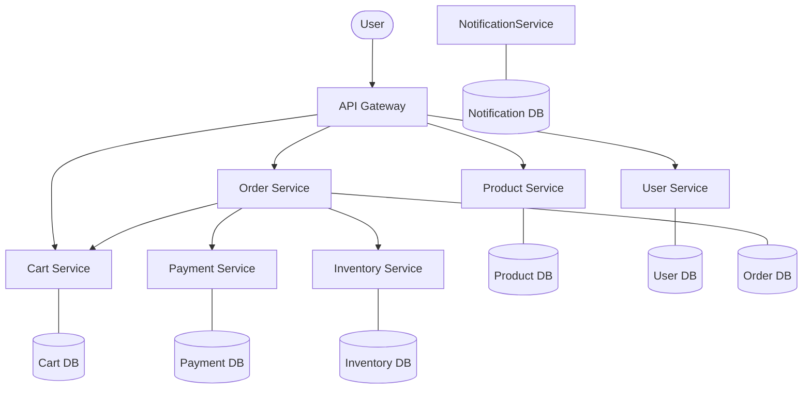

# Scalable E-commerce Architecture

## Overview
This project is built using an **Event-Driven Microservices Architecture** to ensure high scalability, fault tolerance, and independent deployability of services.

## Core Services
1. **API Gateway (8080)**: Entry point for all requests. Handles routing and CORS.
2. **Product Service (8081)**: Manages catalog, categories, and inventory-linked product data.
3. **User Service (8082)**: Handles authentication (JWT) and user profiles.
4. **Cart Service (8083)**: Manages temporary shopping sessions (Redis + Postgres).
5. **Order Service (8084)**: Orchestrates order creation and status history.
6. **Payment Service (8085)**: Mock payment processing for Phase 1.
7. **Inventory Service (8086)**: Real-time stock management and reservations.
8. **Notification Service (8087)**: Asynchronous communication hub.

## Technology Stack
- **Backend**: Java 17, Spring Boot 3.2, Spring Cloud Gateway
- **Database**: PostgreSQL (per service), Redis
- **Messaging**: Apache Kafka (Phase 2 integration)
- **Monitoring**: Prometheus & Grafana
- **Frontend**: React 18, TypeScript, Redux Toolkit, Tailwind CSS

## Component Diagram (Phase 1)

