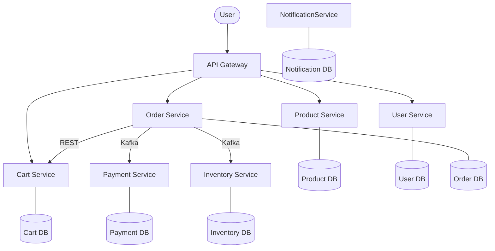
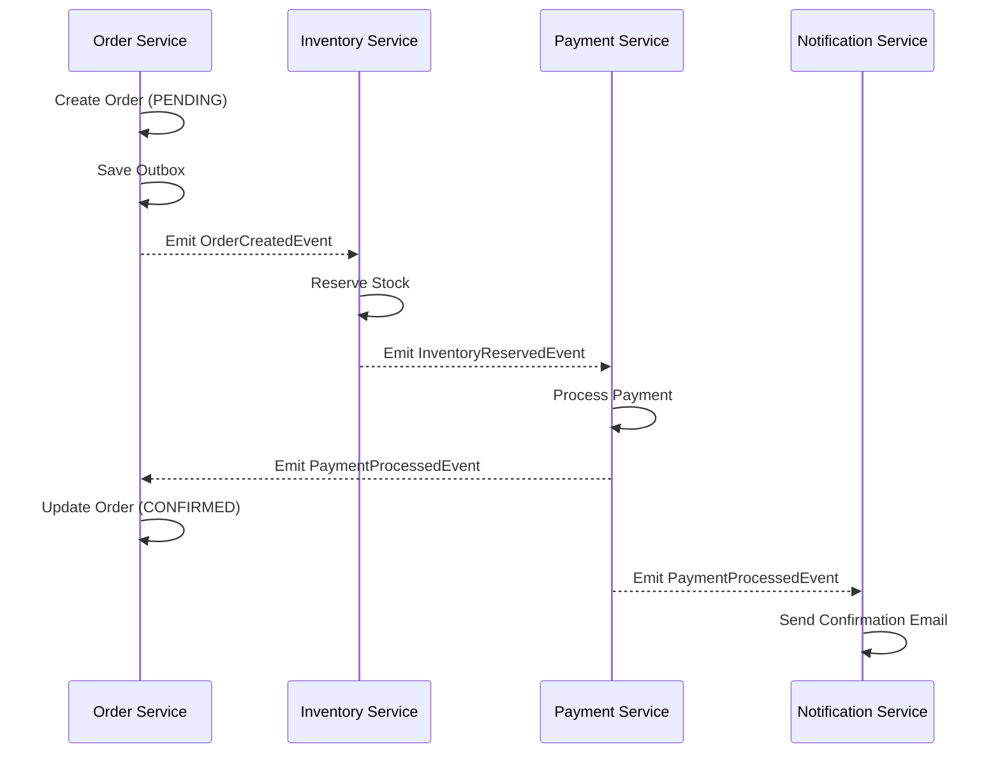
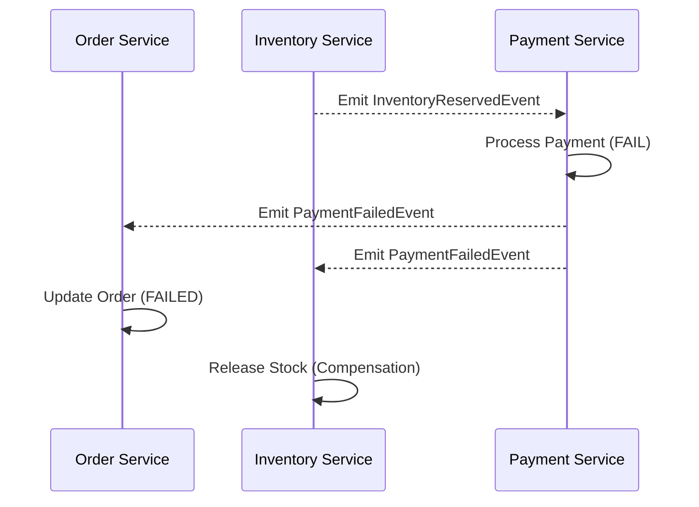

# Technical Design Document

This document provides a comprehensive overview of the **Event-Driven Microservices Architecture** of the E-commerce Platform.

---

## 1. Architecture Overview

High scalability, fault tolerance, and independent deployability are the core pillars of this architecture.

### Core Services
1. **API Gateway (8080)**: Entry point for all requests. Handles routing and CORS.
2. **Product Service (8081)**: Manages catalog, categories, and inventory-linked product data.
3. **User Service (8082)**: Handles authentication (JWT) and user profiles.
4. **Cart Service (8083)**: Manages temporary shopping sessions (Redis + Postgres).
5. **Order Service (8084)**: Orchestrates order creation and status history.
6. **Payment Service (8085)**: Mock payment processing.
7. **Inventory Service (8086)**: Real-time stock management and reservations.
8. **Notification Service (8087)**: Asynchronous communication hub.

### Technology Stack
- **Backend**: Java 17, Spring Boot 3.2, Spring Cloud Gateway
- **Database**: PostgreSQL (per service), Redis
- **Messaging**: Apache Kafka
- **Observability**: Prometheus & Grafana
- **Frontend**: React 18, TypeScript, Redux Toolkit, Tailwind CSS

### Component Diagram

---

## 2. Event Catalog

### Order Domain
- **`orders.created`**: Produced by Order Service when a new order is initialized.
- **`orders.cancelled`**: Published when an order is voided.

### Inventory Domain
- **`inventory.reserved`**: Emitted when items are successfully held.
- **`inventory.failed`**: Emitted when stock is insufficient.

### Payment Domain
- **`payments.processed`**: Confirms successful transaction.
- **`payments.failed`**: Reports payment rejection (triggers rollback).

---

## 3. Saga Workflows (Choreography)

### Successful Order Flow

### Rollback: Payment Failure

