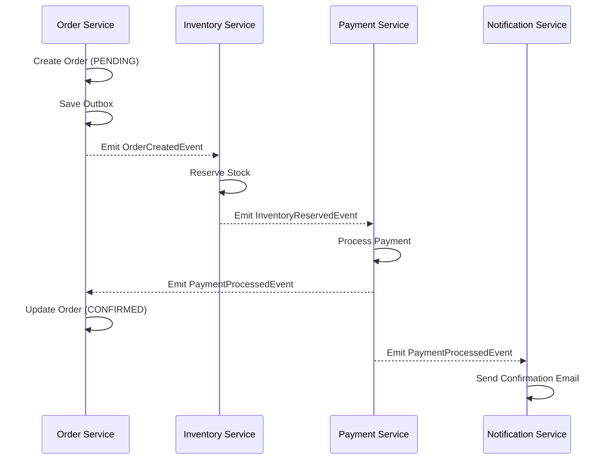
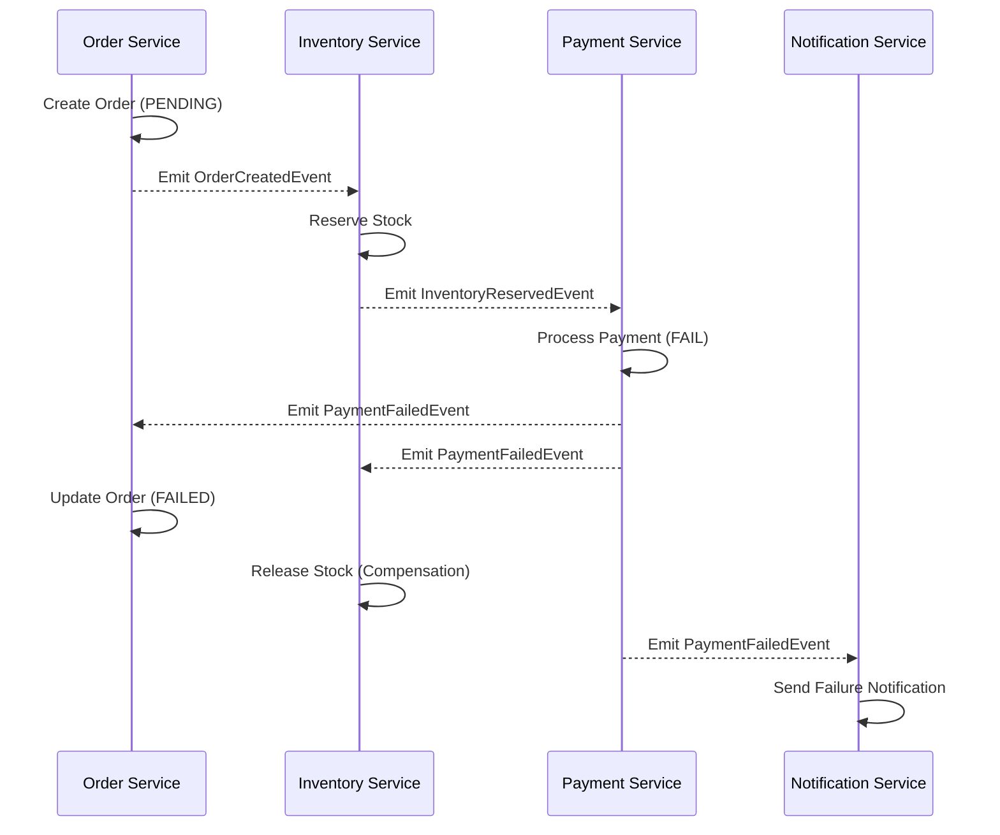
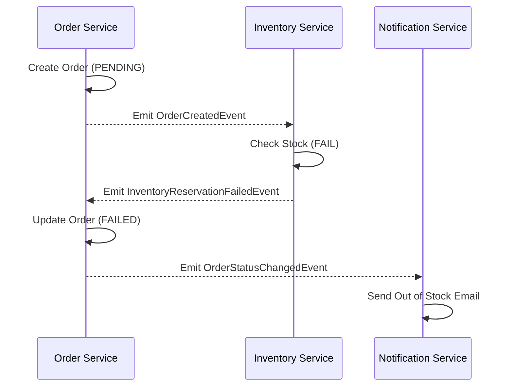

# Saga Workflows (Choreography)

This document visualizes the distributed transaction flows using the Saga pattern.

## 1. Happy Path: Successful Order

## 2. Compensation Path: Payment Failure

## 3. Compensation Path: Stock Insufficiency

